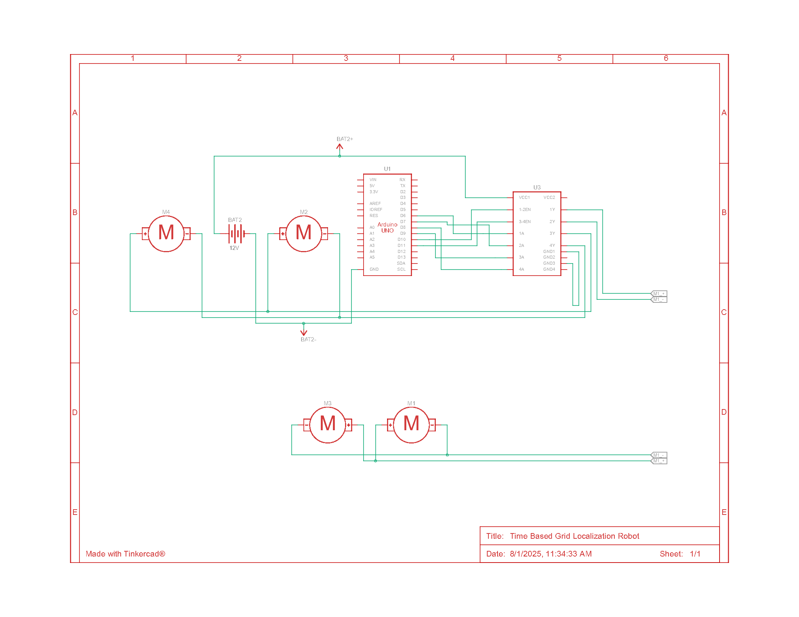

# Time-Based Grid Localization Robot

An autonomous robot that navigates to a destination on a 5x5 grid using time-based open-loop control. Built with Arduino Uno and controlled via an L298N motor driver.

## Working Principle

The Time-Based Grid Localization Robot operates on an open-loop control system, relying on predetermined timing rather than real-time feedback. The Arduino Uno orchestrates all logic, beginning with the configuration of digital pins for the L298N motor driver in the `setup()` function. The robot locates its destination by scanning a hardcoded 5x5 grid for the cell marked with a `1`, storing its coordinates as the target.

- **Initialization:**  
  At startup, the robot sets all motor driver pins as outputs and determines the destination coordinates from the grid.

- **Navigation Sequence:**  
  The main logic in `loop()` runs once, calling `gotoDestination(destX, destY)`. The robot calculates the required travel distances (`deltaX`, `deltaY`) from its current position to the destination.

  - **Vertical Movement:**  
    The robot moves along the Y-axis first, traveling forward for a duration based on `deltaY * CELL_TRAVERSE_TIME`.

  - **Reorientation:**  
    After stopping, it performs a 90-degree turn (duration: `TURN_TIME_90`) to align with the X-axis.

  - **Horizontal Movement:**  
    It then moves forward along the X-axis for `abs(deltaX) * CELL_TRAVERSE_TIME`.

  - **Final Orientation:**  
    Upon reaching the destination, the robot updates its internal coordinates and performs a final turn to face forward along the Y-axis.

- **Open-Loop Accuracy:**  
  The robot's accuracy depends entirely on pre-calibrated time constants for movement and turning, as it lacks sensors to correct for any drift or deviation.

## Circuit Diagram

